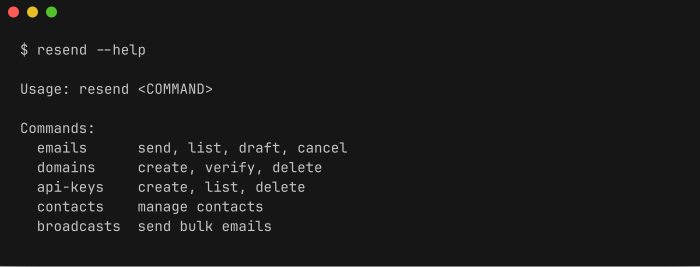
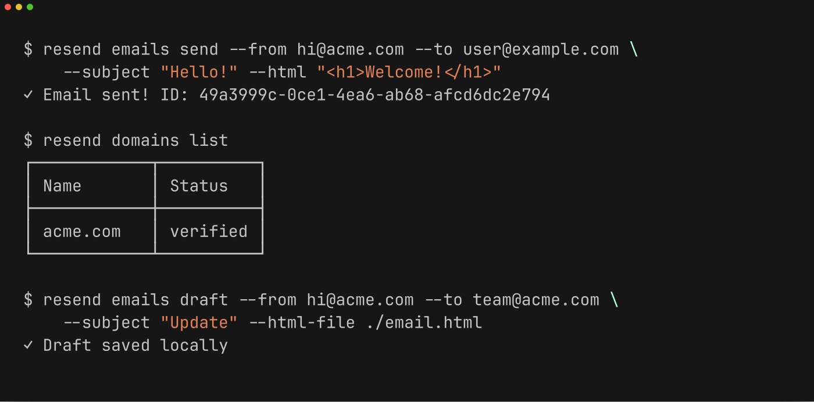

# Resend CLI

A command-line interface for the [Resend](https://resend.com) API. Send emails, manage domains, contacts, and more from your terminal.





## Installation

```bash
cargo install resend-cli
```

## Configuration

```bash
resend config --api-key YOUR_API_KEY
# or
export RESEND_API_KEY=YOUR_API_KEY
```

## Usage

```bash
# Send an email
resend emails send --from hi@acme.com --to user@example.com \
    --subject "Hello!" --html "<h1>Welcome!</h1>"

# List domains
resend domains list

# Save a draft locally
resend emails draft --from hi@acme.com --to team@acme.com \
    --subject "Update" --html-file ./email.html
```

## Commands

| Command | Description |
|---------|-------------|
| `emails` | send, list, draft, cancel emails |
| `domains` | create, verify, delete domains |
| `api-keys` | create, list, delete API keys |
| `contacts` | manage contacts |
| `templates` | manage email templates |
| `broadcasts` | send bulk emails |

## License

MIT
